# 九号秘事S3E3

> [https://movie.douban.com/review/9028822/](https://movie.douban.com/review/9028822/)

 在我心中，S3E3是让我高度集中运转的兴奋剂，是戏剧中的高智商的经典！看第二遍的时候，就燃起了对那些crossword的熊熊好奇心，有了强烈的冲动要把他们都弄明白。于是，今晚花了整整4个小时扒了一遍（又花了一小时发布及排版了一遍），一开始想同时扒剧情结构和字谜的，发现对精神分裂的控制力是在是很艰难的考验，那么今天就先记录字谜这条线吧，明天再扒故事线。

 S3E3以斯芬克斯的谜语为主题，剧情发展通过一条条字谜的破解来推进，最后所有的纵横字谜间又隐藏了整个复仇故事的过程以及结果，还重合了斯芬克斯的神话故事。这之中不仅仅是巧妙这种“趣味”，更有所有的大小逻辑齿轮完美咬合所创造的严丝合缝的秩序感。剧情发展高速、台词高速，打光和背景音乐的情绪节奏，也是精彩之笔！如果要用一个词来概括，那就是——完美！对语言文字有瘾的人方能感受这样的大脑高潮！

 斯芬克斯是教授Nigel的象征，心机深重、嗜好设迷，又冷血无情。

 “The Sphinx is a mythical creature of Greek Legend. A woman’s head on a lion’s body. She guarded the gates of the ancient city of Thebes. Any traveller wishing to pass through had first to solve her riddle. If they failed the test, she would kill them by means of asphyxiation and then… eat the remains. She was devious and deadly. Perfect for a cryptic crossword-setter.

 斯芬克斯是希腊传说中的神话生物。狮身女人头。她守卫着古城底比斯的大门。任何想要进城的旅人都先得解出她的谜语。如果他们没有通过考验，她就会让他们窒息而死然后……吃掉尸体。她心机深重，嗜好杀戮。对于隐晦的纵横字谜来说是个完美的出题者。”

 既然会玩字谜的都是高冷聪酷霸的人，那接下来就让我们一起双语对照学习如何玩英语的纵横字谜游戏吧。

【Hint】 A cryptic clue always offers up two means of solution. The beginning or the end of the sentence gives you the definition of the word. And the rest of the clue is the word play, if you like, which is a kind of riddle.

【提示】一个隐蔽的线索总是包含两个解谜方法。句子的开头或结尾告诉你谜底那个词的含义。线索的剩余部分是文字游戏，也可以算是一个谜语。

【Example】I teach wild creature without hospital building. 12 letter.

【范例】我在没有医院大楼的情况下教野生动物。12个字母

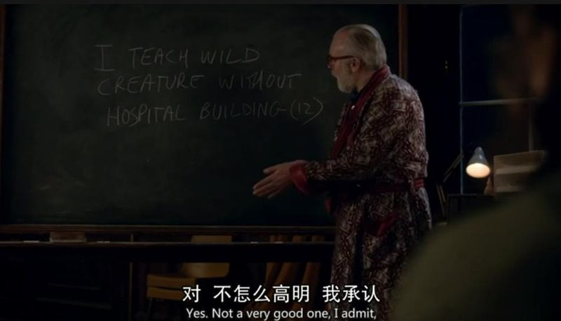

 “I teach” or “Building”. The word “Wild” is what we refer to as an anagram-indicator. It suggests the letters can be jumbled up and rearranged. So anything such as “upset”, “excited”, “insane”. It’s telling us to mix up the letters.

 “我教”或“大楼”。“野生”这个词是我们所称的“易位构词指示词”。它体现为字母可以变换顺序，重新排列。所以比如“生气的”、“兴奋的”、“精神病的”这类词。它告诉我们要把字母混合。

 So if we take the words “I teach” and “creature” and make them “wild”, we might come up with a solution.

 所以如果我们重新排列“我教”和“动物”里面的字母并让他们有“wild”的含义，也许就能得到答案。

 We’re two letters over. So we look here, “without hospital”. Now in terms of letters, what could “hospital” be? We need two letters, remember? If you were to have an accident, if I’d shot you here in the dark…you’d head straight for which department? \(Nina: A&E?\) Excellent!

 我们多了两个字母。于是我们看这里，“没有医院”。现在用哪些字母可以表示“医院”？我们需要两个字母，记得吗？如果你出了事故，如果我在黑暗中开枪打伤了你，你会马上到哪个部门？（Nina：急诊室？）太棒了！

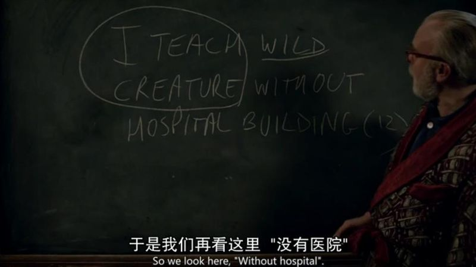

 So if we remove “A” and “E” from “creature”, i.e. “creature without hospital” and mix up with “I teach”, then we get an anagram of 12 letters meaning “building”, which is…? “Architecture”!

 那么如果我们把“生物”里的字母A和E去掉，也就是“没有医院的生物”，然后和“我教”里的字母混合，那么我们得到一个有12个字母的字母变位词，意思是“大楼”，那就是……？“建筑”！

 I haven’t parsed it properly. I buried the anagram-indicator in the fodder. But it was simply an illustration.

 我分解的不够好，我把变位构词指示词埋藏到素材里了。不过这就是简单举例说明一下。

【好了，教授这个”red-blooded mammal”炫耀完毕之后，复杂的解谜游戏正式开始。】

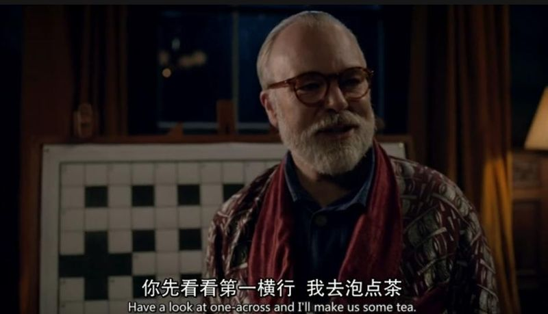

【字谜1】

1-across: To wound and wander destitute \(4, 3, 3\)

横行第1个：受伤后一无所有地游荡

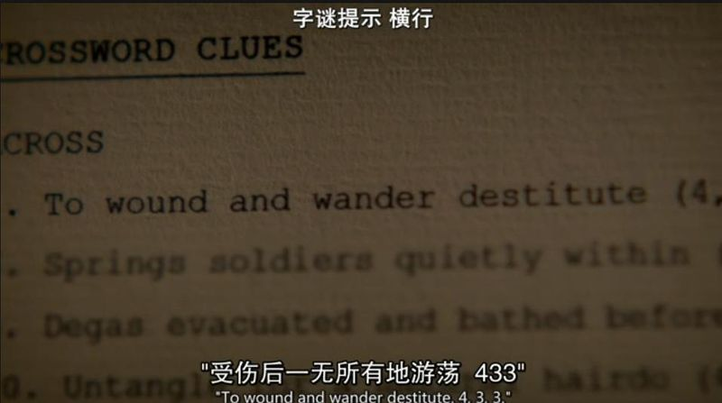

Look for a verb or an adjective that suggests movement. \(Nina: Wander?\) Bingo!

找出显示移动的动词或形容词。（Nina：游荡？）对了！

\(Nina: Down-and-out, meaning destitute.\) Excellent！

（Nina：穷困潦倒，意思就是一无所有。）棒极了！

【教授引导Nina进行脑力热身，Nina渐入佳境，逐渐暴露出女司机本色。】

Competitive solving can be quite combative, believe me. Blood has been spilt. Metaphorically, of course.

相信我，解谜竞赛可以是非常战斗激烈的。血溅赛场。当然这是个比喻的说法。

What’s black and white and red all over? The Cambridge crossword competiton. \(Nina: Or a nun chewing a razorblade.\) Or a penguin with sunburn.

什么是又黑又白又红的？就是剑桥纵横字谜竞赛。（Nina：或者是一个嚼着刀片的修女。）或者是一只晒伤的企鹅。

\(Nina: What’s long and hard and full of seamen? A submarine.\)

（Nina：什么东西又长又硬还充满了精液（水手）？潜水艇。）

And what’s pink and hard in the mornings? The… \(Nina: A cock?\) Financial Times’ crossword.

在每天早上又粉又硬（难）的是什么？是……（Nina：鸡巴？）《金融时报》上的纵横字谜游戏。

【字谜2】

2-down: This cover sounds like a 50 Cent song

纵列第2个：这个封面听起来像一首“50美分”的歌

“Sounds like” indicates a homophone. Think of a four-letter word meaning “To cover” which sounds like a type of song. Beginning with W? \(Nina: Wrap.\) Correct! That’s two in two minutes!

“听起来像”指的是同音词。想一个意思是“覆盖”的四个字母的词，但听起来像是一种歌曲，开头是W的？（Nina：包裹。）正确！两分钟就解出来了两个！

【字谜3】

1-down: Indian national product of French-Italian agreement

纵列第1个：产自印度的法国-意大利合约

…is simply “Of” in French followed by an Italian form of agreement, making “Desi” a person from India.

关键词是“法国的”，后面是一种意大利表达同意的方式，也就是“德西”，一个印度人。

【字谜4】

18-down: Tory leader on board for English flower

纵列第18个：托利党领袖为了英国的花朵上船

\(Nina: So that’s a five-letter word for Tory leader.\) Or… \(Nina: English flower? Er… poppy! Daisy!\) Don’t guess. Deduct. And don’t take anything for granted. Now, what could “Tory leader” be?

（Nina：所以是表示托利党领袖的五个字母？）或者是……（Nina：英国的花朵？呃……罂粟花！雏菊！）不要猜，要解析。也不要想当然而忽略细节。那么，托利党领袖会是什么意思？

\(Nina: T.\) That’s right! So put T on to a four-letter word for “Board”. A board has more than one meaning remember? What kind of board do you pay? Rent! You pay to board somewhere. So put Tory leader “T” onto “Rent”, it gives you… \(Nina: Trent! But that… that’s not a flower!\) Who said it was a flower? You said “Flower”. What I actually wrote was “Flow-er”. Something that flows. In this instance, and English river called the Trent.

（Nina：T。）没错！那么T加上一个意思是“船板”的四个字母的词。“船板”不止有一个意思记得吗？有什么“板”是你要付钱的？租金！你付钱去睡在某个地方的“床板”上。所以把托利党的首字母T放到Rent前，就得到……（Nina：特伦特！但这个……这个不是花啊！）谁说是“花”了？你念的是“花”，实际上我写的是“流动物”。流动的某个东西。在这里说的是英国的一条河，叫做特伦特。

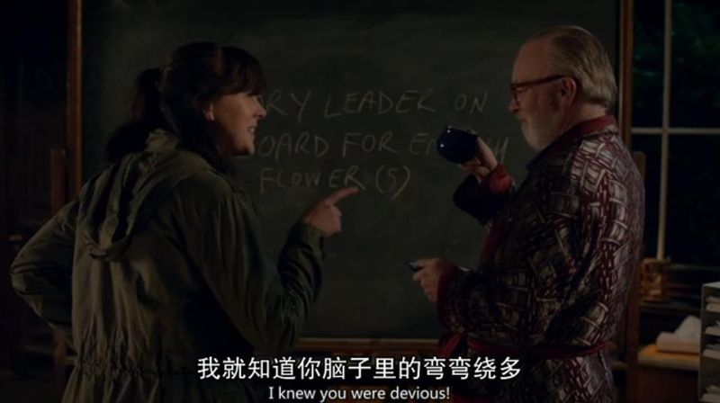

【字谜5】

9-across: Degas evacuated and bathed before putting big pictures in bog

横行第9个：德加在把大画放进沼泽前先排泄并沐浴

If you evacuate something, you clear it out. So we remove the middle letter to leave D and S. “Bathed” is another word for “Swam”. So “Bathed before” means we put “Swam” in front of DS. And “Putting big picture in”… we need to insert another word for a big picture. A grand scheme, a…

如果你排出什么东西，就是把它清掉。所以去掉中间的字母，留下D和S。过去式的“沐浴”的另一个同义词是过去式的“游泳”。所以“先沐浴”就是把Swam放在DS的前面。以及“把大画放进”……我们需要给“大画面”插进一个词。一个大计谋，一个……

\(Nina: Plan.\) “Plan”! Precisely! So we put “Plan” between “Swam” and “DS” to make “Swamplands”, meaning “Bog”! Yes?

（Nina：计划。）计划！精准！所以我们把“Plan”放到“Swam”和DS中间，就组成了“Swamplands”，意思就是“Bog”！对吗？

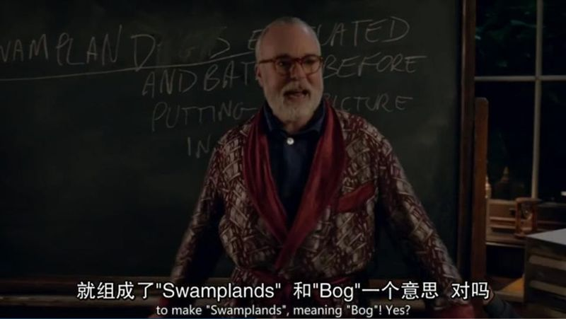

\(Nina: Well shouldn’t it be “Bogs”\) No necessarily.

（Nina：那不是应该是复数吗？）并不必要。

\(Nina: You said it has to be precise.\) Yes it is precise. Not a word wasted.

（Nina：你说的一定得精准。）没错这很精准。一个词都没浪费。

\(Nina: Otherwise you’d be cheating, wouldn’t you?\) I never cheat. Never!

（Nina：要不然刚才你就是在作弊了，对吧？）我从来不作弊。从来！

【Nina在暗示教授作弊后，看他茶也喝的差不多了，便放松了许多开始发挥聪明才智。】

【字谜6】

3-down: A disturbed setter concealed a tiny amount. “Why? It’s enough to take one’s breath away.”

纵列第3个：一个心烦意乱的设置者隐瞒了一小点。“为什么？这够让人无法呼吸的。”

\(Nina: Well, the crossword setter is you. So have you concealed a tiny amount, Mr. Sphinx? Maybe. So it’s “A” followed by an anagram of “Sphinx”. And “Tiny amount” is “Iota”, which is also the ninth letter the Greek alphabet which I’m sure you know, Professor Squires. And “Why” is a homophone of the letter Y…meaning “To take one’s breath away”.\)

（Nina：你是纵横字谜的设置者，所以你隐瞒了一小点是吗，斯芬克斯先生？也许哦。所以这里填A，跟着是Sphinx的变位，“一小点“就是Iota，也是希腊字母表的第九个字母，我确定以及肯定你知道，斯夸尔教授。然后“为什么”和字母Y同音……意思是“让人无法呼吸”。）

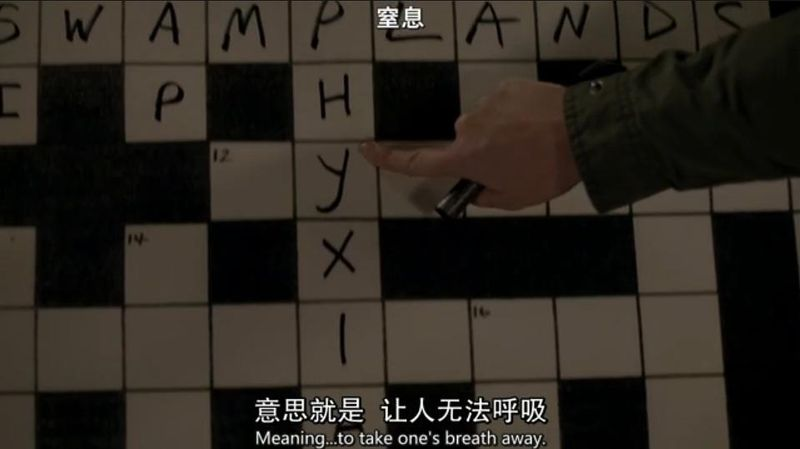

【教授全身僵硬坐在扶手椅中，Nina就有如手握神来之笔开始嗖嗖填满各个格子。】

【字谜7】

Dickens character undertakes to be a cabinet maker

狄更斯笔下成为木工的人物

\(Nina: Well that’s obviously Sowerberry from Oliver Twist. You’ll be needing his service before long. \)

（Nina：这明显是《雾都孤儿》里的棺材店老板索尔贝瑞。你很快就会需要他的服务了。）

【字谜8】

Some smart aleck, no wit, allegedly

某些自作聪明的人，没有真才智

\(Nina: Know-it-all.\)

（Nina：百事通。）

【Nina太过激动兴奋——大学生还是沉不住气啊——扔下粉笔对教授说出了真实身份，没想到嘴歪眼斜的教授立刻露出了狡黠的笑容，原来刚才是在诈她，可以说是演技爆表，还顺带嘲笑了一下她的用词形态错误。教授神气活现地站起来，刚才Nina的表现让他文字瘾发作，控计不住寄己来到黑板前继续完成字谜游戏。】

【字谜9】

22-down: What is a frankfurter’s number-one bun?

纵列第22个：法兰克福香肠的头号面包是什么？

Well if we don’t start “One” or “Bun”, then we get “Neun” which is a number if you happen to come from Frankfurt.

如果我们不以“One”或者“Bun”开头，那我们得到“Neun”（德语的9）这个数字，如果你刚好来自法兰克福的话。

【字谜10】

23-down: The origins of a species popularized savage serpents

纵列第23个：让凶猛毒蛇繁盛的物种的起源

“Origins” telling us to take the first letters of “A species popularized savage”, giving us “Serpents”.

“Origins”让我们从“一种让凶猛的繁盛”中取首字母，得出“毒蛇”。

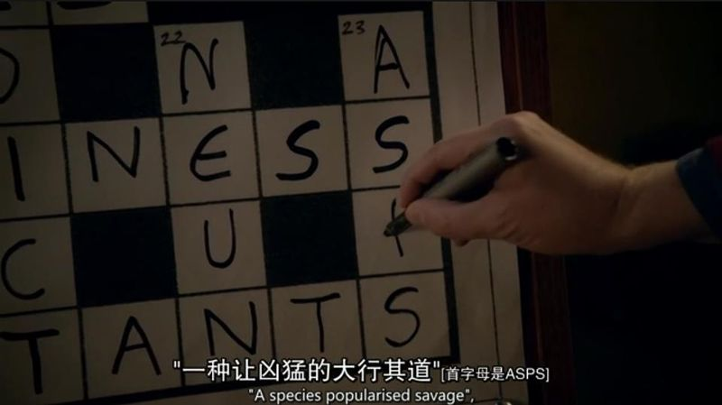

【教授把字母连起来告诉Nina，自己换了杯子，原来她才是要窒息的那个人。Nina开始全身变僵硬。教授打了电话后，泰勒博士一会儿就要出场了。】

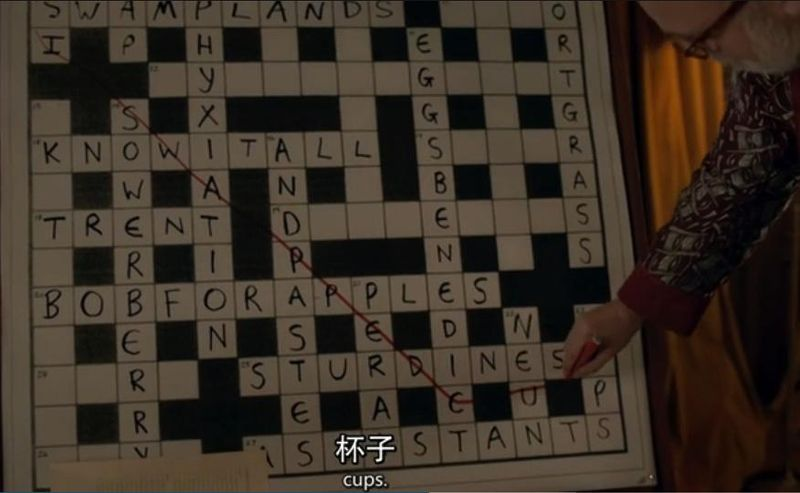

【字谜11】

5-down: Knocked back beer and wine then put on one French undergarment

纵列第5个：倒着喝下的啤酒和酒然后穿上一件法式内衣

Well “Knocked back” is telling us to write something in reverse. In this instance, a type of beer “Pils” and a type of wine “Red”. Then if we put on “One” in French, which is “Un”, we get our undergarment. See? “Underslip”.

“倒着喝下的”告诉我们要反过来写。在这种情况下是一种啤酒“皮尔森”和一种葡萄酒“红酒”。然后我们把“一”用法语写就是“UN”，我们得到了“内衣”，看到了吧？“肚兜”。

【泰勒博士上场。然而他也是个有文字瘾的人，应该救人的紧要关头他扭头一看发现了黑板，居然立刻跑偏去兴致勃勃玩文字游戏！】

【字谜12】

I hear American poet solved the riddle of the pseudo-hotel patron.

我听到一个美国诗人解开了宾馆的冒牌赞助人出的谜。

The American poet is Edgar Guest. Mr. E Guest. “A riddle solved” is a mystery guessed. And a “Pseudo-hotel patron” is a… \(Tyler: Mystery guest.\)

这个美国诗人是埃德加·盖斯特。E·盖斯特先生。“被解开的迷”指被猜出来的神秘事件。而“宾馆的冒牌赞助人”是一个……（泰勒博士：神秘来客。）

【字谜13】

7-down: Catch a train before a poisonous bite

纵列第7个：在被咬了有毒的一口前赶火车

\(Tyler: Well “Catch” usually stands for “Fish”, I know that much. “A train before” could be “Puffer”. So yeah, “Puffer fish”.\)

（泰勒博士：“追捕”一般代表捕“鱼”，这个我非常清楚。“以前的火车”可能是“蒸汽”（河豚）。所以没错，“河豚”。）

【此仇省略泰勒博士复仇的1024x576字。离开前，泰勒博士用教授的中间名Hector给整个纵横字谜划出了重点。教授饮弹自尽，脑浆血液喷到了最后一条谜底上。】

如果你看到了这里，那么谢谢你。如有你发现了任何需要更正的地方，并且有着讨论的热情，请尽请留言吧！我终于可以支撑起关节变僵硬疼痛的双腿，挪到厕所去evacuate了……

【彩蛋】

在另一篇影评指引下搬过来这集播出当天英国卫报的填字游戏，即是这集当中的所有谜题。

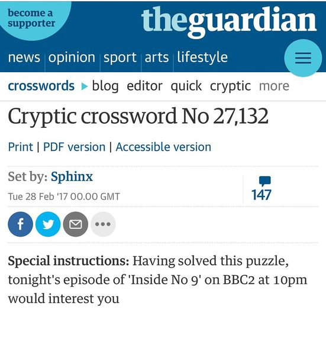

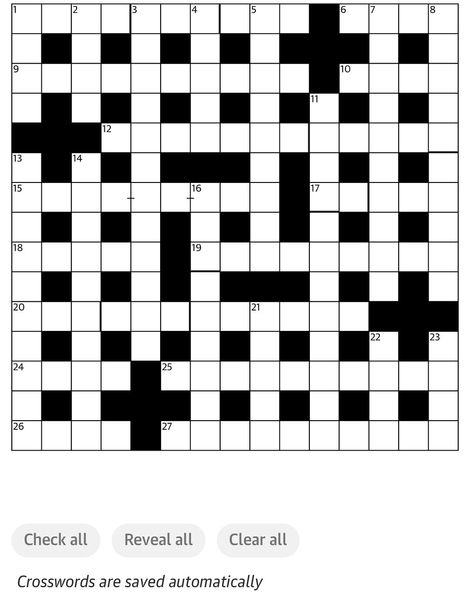

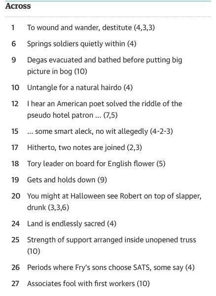

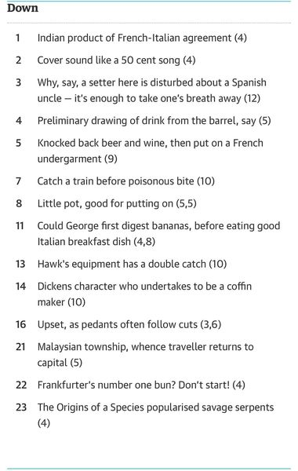

